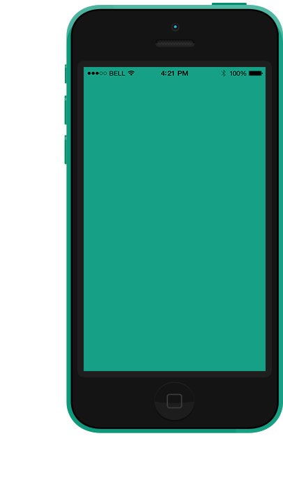

<html lang="ru">
<head>
    <meta charset="UTF-8">
    <meta http-equiv="X-UA-Compatible" content="IE=edge">
    <meta name="viewport" content="width=device-width, initial-scale=1.0">
    <link rel="stylesheet" href="https://cdnjs.cloudflare.com/ajax/libs/font-awesome/6.0.0-beta3/css/all.min.css" integrity="sha512-Fo3rlrZj/k7ujTnHg4CGR2D7kSs0v4LLanw2qksYuRlEzO+tcaEPQogQ0KaoGN26/zrn20ImR1DfuLWnOo7aBA==" crossorigin="anonymous" referrerpolicy="no-referrer" />
    <link rel="preconnect" href="https://fonts.googleapis.com">
    <link rel="preconnect" href="https://fonts.gstatic.com" crossorigin>
    <link href="https://fonts.googleapis.com/css2?family=Montserrat:wght@100;400;700;800&display=swap" rel="stylesheet">
    <link rel="stylesheet" href="css/style.css">
    <title>Photo</title>
</head>
<body>
<header id="header">
   

       

            <nav>
                <ul>
                    <li><a  class="active" href="#">Home</a></li>
                    <li><a href="#">Photo App</a></li>
                    <li></li>
                    <li><a href="#">Design</a></li>
                    <li><a href="#">Download</a></li>
                </ul>
            </nav>
       

    

</header>

<section id="Hero">
   

    

        

            <h1 >YOUR LIFE, A PHOTO</h1>
            
print your life in a simple photo

            <a href="#" class="bth">GET STARTED</a>  
        

        

            <a target="-blank" href="https://twitter.com/?lang=ru"> <i class="fab fa-twitter fa-2x"></i></a>
             <a target="-blank" href="https://www.facebook.com/"><i class="fab fa-facebook-square fa-2x"></i></a>
             <a target="-blank" href="https://www.instagram.com/"><i class="fab fa-instagram-square fa-2x"></i></a>
        

    

   

</section>

<section id="photo">
    

        

           

                

                    <h2>RAPPRESENT YOUR LIFE WITH  SIMPLE   PHOTO</h2>
                    
Lorem ipsum dolor sit amet consectetur adipisicing elit. Eum, a nam nisi neque vel ipssasd suscipit dolor alias? Similique voluptatibus necessitatibus, except esse, suscipit expedita. Ut enim ad minim illum exercitationem commodi dolore.

                    <a href="#" class="bth link">GET STARTED</a>
                

                

                    
                

           

        

    

</section>

<section id="DESIGN">
    

        

            

                

                    
                

                

                    <h2>DESIGN</h2>
                    
Lorem ipsum dolor sit amet consectetur adipisicing elit. Eum, a nam nisi neque vel ipssasd suscipit dolor alias? Similique voluptatibus necessitatibus, except esse, suscipit expedita. Ut enim ad minim illum exercitationem commodi dolore.

                    <a href="#" class="bth link">LEARN MORE</a>
                    
 01/05

                    <i class="fas fa-chevron-left slider"></i>
                    <i class="fas fa-chevron-right slider"></i>
                

               
           

        

    

</section>

<section id="COMMUNITY">
    

        

            <i class="fas fa-chevron-left"></i>
            <i class="fas fa-chevron-right"></i>
          

          

            

              
              <h5>
                OUR COMMUNITY
              </h5>
              

                Lorem ipsum dolor sit
                amet consectetur
                adipisicing elit.
              

            

            

              
            

            

              
            

          

    

</section>

<section id="Email">
    

        <h1>SUBSCRIBE TO US COMMUNITY</h1>
        

           <input type="Email" placeholder="Email">
           <a class="check" href="">
            <i class="fas fa-check "></i>
          </a>
          

        

    

</section>

<section id="DOWNLOAD">
     

         

             
DOWNLOAD IT

             
Lorem ipsum dolor sit amet consectetur adipisicing elit. Modi atque cupiditate, officiis nihil aliquid, voluptatum ipsum natus exercitationem et sit doloremque fuga tempora in ut, optio tenetur ea provident iure.

             

                 

                    APPLE STORE
                    <a target="_blank" href="https://www.apple.com/"><i class="fab fa-apple "></i></a>
                 

                 

                   PLAY STORE
                    <a target="_blank" href="https://www.android.com/"><i class="fab fa-android "></i></a>
                 

             

         

     

</section>

<footer id="footer">
    

        

            

                

                    <h3>CREBETS</h3>
                    <h3>PRIVACT</h3>
                    <h3>OUT TEMANTS</h3>
                

                
Copyright by photoime - all right reserved

            

            

        

    

</footer>
</body>
</html>
